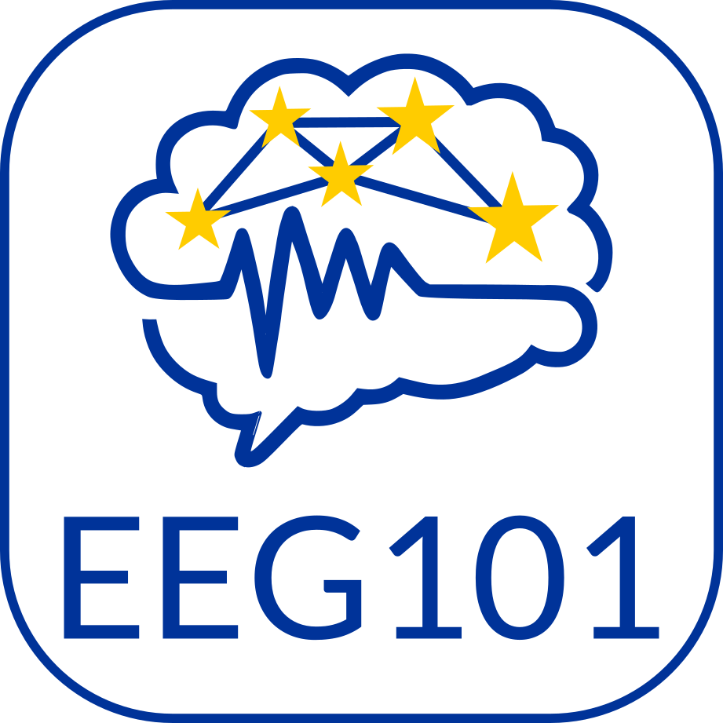
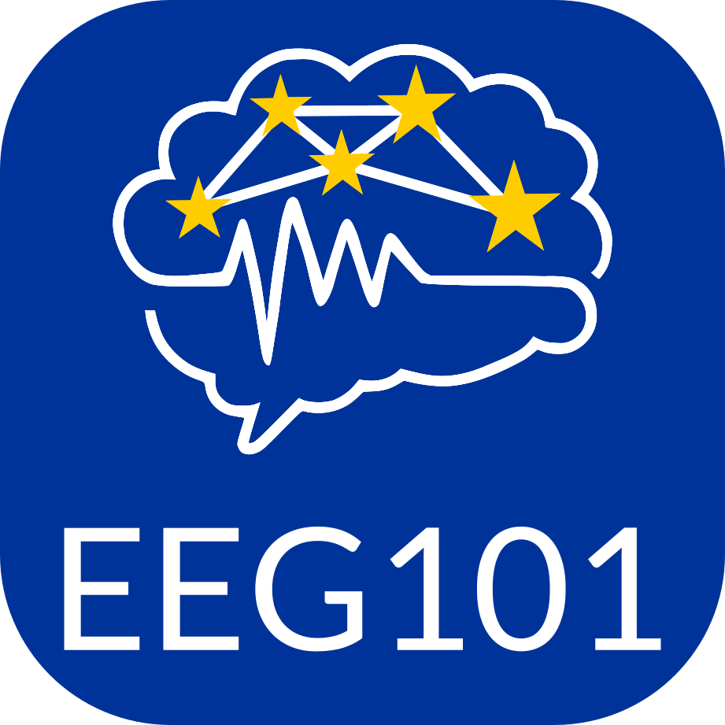
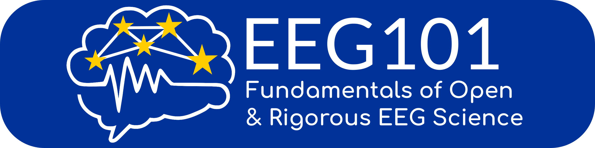
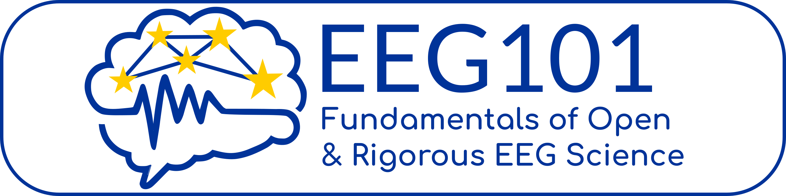
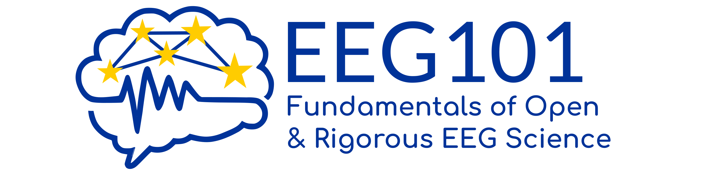

This page presents the official EEG101 logos including the color scheme and fonts. Download a [zip file](https://github.com/eeg101-costaction/eeg101-costaction.github.io/raw/refs/heads/main/EEG101-logos.zip) for all logo variations in different file formats.

# --------- Squared versions ---------   

     

   

  

# --------- Rectangle versions ---------

 

  

# --------- Border free versions ---------
       

  

# Color specifications
## Color Gold

**Pantone Yellow**  
HEX: #FFCC00  
RGB: 255, 204, 0  
CMYK: 0, 21, 100, 0  

## Color Azure

**Pantone Reflex Blue**   
HEX: #000099  
RGB: 0, 51, 153    
CMYK: 100, 80, 0, 0  
